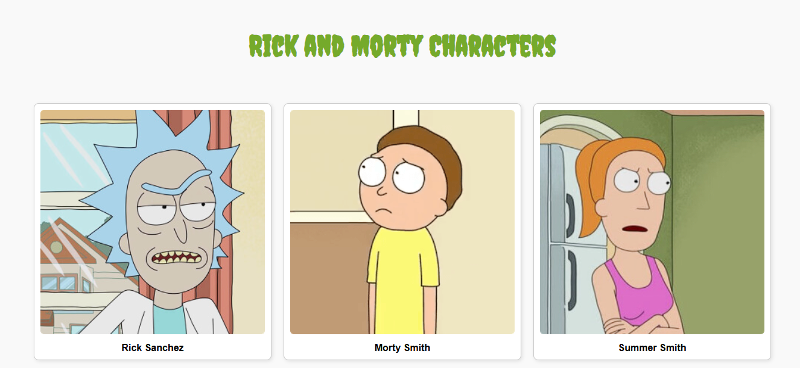
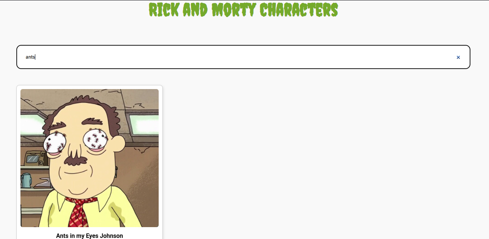

# Rick and Morty Character Viewer

This project showcases a list of characters from the Rick and Morty universe using data fetched from the Rick and Morty API. It is built using HTML and CSS for structure and styling, and JavaScript for fetching data and dynamically rendering content to the DOM.

Each character is displayed with an image and name in a responsive grid layout, showing three characters per row.

## Preview




## Getting Started
1. Clone this project:
```
git clone https://github.com/ranandasatria/fgo24-dom-fetching
```

2. Install the depedencies:
```
npm install
```

3. Run the project:
```
npm run dev
```

4. The project will be runnning at:
``` 
http://localhost:8080
```

## Depedencies

This project uses Node.js. Make sure you have Node.js installed on your machine.

- live-server: to simulate an HTTP server in a local environment.

## How to contribute

Please open a Pull Request (PR) to contribute to this project.
Your PR will be reviewed and merged if necessary.

## License

This project following MIT License.

## Copyright
&copy; 2025 Kodacademy


